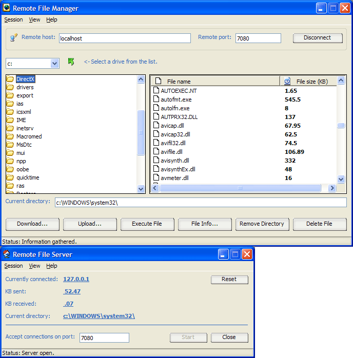



## \_ Remote File Manager \_

### Description

This client/server program allows you to remotely manage files on another computer via Winsock. It includes: upload file, download file, delete file, remove directory, get file information, and execute file. I've seen alot of these programs on here but they were either very buggy or didn't work at all.

I also made a file transfer control (sender & receiver) which comes attached with this program. Please report any errors/bugs, and leave a comment if you want. :)
 
### More Info
 

             |
---                |---
**Submitted On**   |2003-12-01 21:37:00
**By**             |[Daniel W\. Elkins](https://github.com/Planet-Source-Code/PSCIndex/blob/master/ByAuthor/daniel-w-elkins.md)
**Level**          |Intermediate
**User Rating**    |4.9 (202 globes from 41 users)
**Compatibility**  |VB 4\.0 \(16\-bit\), VB 4\.0 \(32\-bit\), VB 5\.0, VB 6\.0
**Category**       |[Complete Applications](https://github.com/Planet-Source-Code/PSCIndex/blob/master/ByCategory/complete-applications__1-27.md)
**World**          |[Visual Basic](https://github.com/Planet-Source-Code/PSCIndex/blob/master/ByWorld/visual-basic.md)
**Archive File**   |[\_\_Remote\_F1678921212003\.zip](https://github.com/Planet-Source-Code/daniel-w-elkins-remote-file-manager__1-50253/archive/master.zip)

